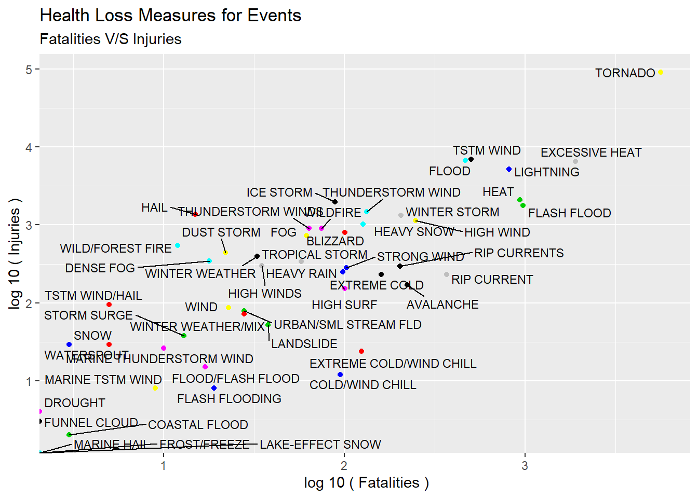
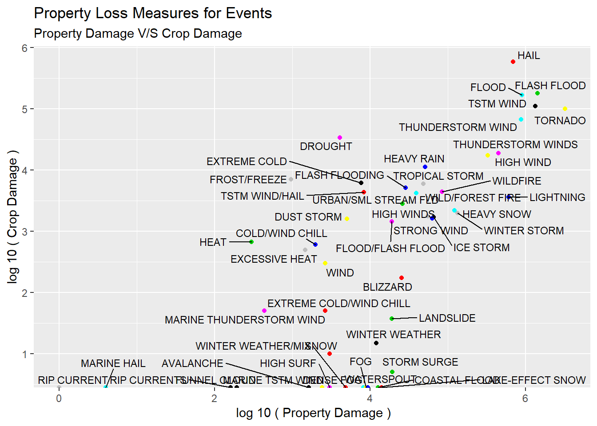
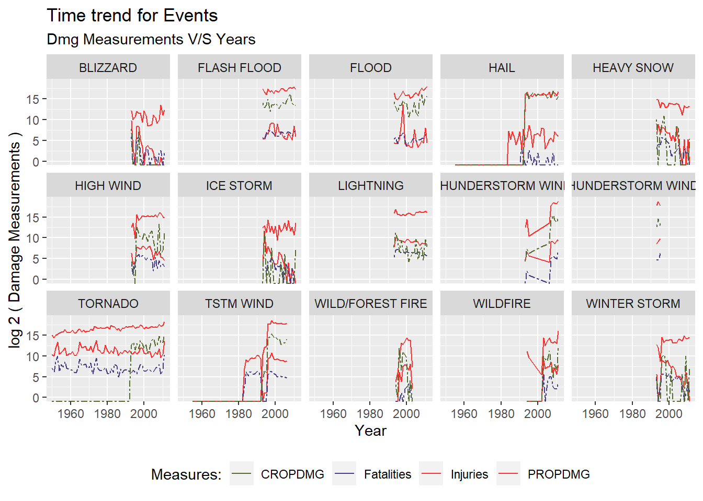

### Title : Major storms or other weather events. Which one is more dangerous ?


## Synopsis : 

In this report I am exploring the NOAA Storm Database and answering some basic questions about severe weather events. 
Sometimes weather  is extreme, causing destruction and death, damaging public & personal properties. This dataset includes the injuries & fatality numbers which  represents the health loss of people due to each recorded event in the last 60 years. Also there are variables for estimating the economic/property loss of people  in the column *PROPDMG* & *CROPDMG* according to the databse info file. I have tried to look at the top worst weather events/ storms,  since the  questions that we are asking are concerned about those issues.  If you think about it, it also is a kind of event prioritization step in my analysis of this data. Thus I first pick the top events with most number of events reported.  Missing value check is done for the 4 variables shortlisted  **(FATALITIES, INJURIES, PROPDMG, CROPDMG).**  First I get the top events doing the most damage. Then an intersection of those 2 lists further helps us to prioratize the events and claim them to be more dangerous. Finally I have shown the profile of final calamities with a timeseries plot with lines of all the 4 variables.  


The data was downloaded from this link [Storm Data](https://d396qusza40orc.cloudfront.net/repdata%2Fdata%2FStormData.csv.bz2) on 30-August-2020  

## Data Processing


```r
# Downloading the data
download.file("https://d396qusza40orc.cloudfront.net/repdata%2Fdata%2FStormData.csv.bz2", "./Data.csv.bz2", method = "curl")

#Reading data
Data <- read.csv("./Data.csv.bz2", header = T)
# Dim 902297*37

head(Data[1:6])
```

```
##   STATE__           BGN_DATE BGN_TIME TIME_ZONE COUNTY COUNTYNAME
## 1       1  4/18/1950 0:00:00     0130       CST     97     MOBILE
## 2       1  4/18/1950 0:00:00     0145       CST      3    BALDWIN
## 3       1  2/20/1951 0:00:00     1600       CST     57    FAYETTE
## 4       1   6/8/1951 0:00:00     0900       CST     89    MADISON
## 5       1 11/15/1951 0:00:00     1500       CST     43    CULLMAN
## 6       1 11/15/1951 0:00:00     2000       CST     77 LAUDERDALE
```

### Looking at the data

First we can aim to reducing the size of data. Filtering out unwanted data varaibles can be done in multiple ways like :

#### One can prioritize the variables required based on the question asked.

In our case our 2 important questions are :  
        **1. Population Health  **  
        **2. Economic loss  **

Thus the columns like EVTYPE, DATE, FATALITIES, INJURIES, PROPDMG, CROPDMG seem relevant. Hence I will reduce the unnecessary data columns which will just be a burden for the code to do analysis.  


```r
    Imp_Vars <- c("BGN_DATE", "EVTYPE", "FATALITIES", "INJURIES", "PROPDMG", "CROPDMG" )
# Subsetting the data
    Data.subset <- Data[,Imp_Vars]
    rm(Data)
```

#### We can also focus on the most frequent events as they're more likely to happen.  

For that we first see the frequency of each event and select the top fifty.  


```r
# Limiting ourselves top 50 most frequent events.
    Events <- table(Data.subset$EVTYPE)
    Events <- sort(Events, decreasing = T)
    
# Shortlisted top 50 events/ natural calamities
    Most_Freq_Events <- names(Events)[1:50]
# sum(Events[1:50]) == 894432; Thus our top 50 frequent incidents cover 99% data points/ rows. Rest of the 935 events are once in chance events probably.

# Getting the relevant rows for those events
    Get_RowIndices_Event <- function(Event) { which(Data.subset$EVTYPE == Event)}

    Row_I <- unlist(lapply(Most_Freq_Events, Get_RowIndices_Event))
    Data.subset <- Data.subset[Row_I,]
    # Dim 894432*6
```


#### Take an estimate of the missing data in the above shortlisted variables  


```r
    NA_Count <- apply(Data.subset, 2, 
            function(x){sum(is.na(x))})
    print(NA_Count)
```

```
##   BGN_DATE     EVTYPE FATALITIES   INJURIES    PROPDMG    CROPDMG 
##          0          0          0          0          0          0
```

No missing data observed hence we will directly proceed with the analysis. First let's compute the total Health loss due to each of the events.


```r
# As you can see I'm using both the metrics for computing the loss. Fatalities & Injuries
FatalitybyEvent <- aggregate(FATALITIES + INJURIES~ EVTYPE, data = Data.subset, sum)
FatalitybyEvent <- FatalitybyEvent[order(FatalitybyEvent$`FATALITIES + INJURIES`, decreasing = T),]

# Top few events causing highest civilian health damage are as follows:
Top_Health_Loss <- as.character(FatalitybyEvent$EVTYPE[1:22])
```

These are the calamities which caused the max damage in civilian healths.  
TORNADO, EXCESSIVE HEAT, TSTM WIND, FLOOD, LIGHTNING, HEAT, FLASH FLOOD, ICE STORM, THUNDERSTORM WIND, WINTER STORM, HIGH WIND, HAIL, HEAVY SNOW, WILDFIRE, THUNDERSTORM WINDS, BLIZZARD, FOG, RIP CURRENT, WILD/FOREST FIRE, RIP CURRENTS, DUST STORM, WINTER WEATHER  

You can see why those make it to the top with this plot.  

```r
    Data.subset$Year <-year(mdy_hms(Data.subset$BGN_DATE))
    
# Transforming the data for plotting
    Newdf <- melt(Data.subset, id =c("EVTYPE", "Year"), measure.vars = 3:6 )
    Event_Casualty <- dcast(Newdf,EVTYPE ~ variable, sum)
    set.seed(42)
    
    Plot1 <- ggplot( data = Event_Casualty, aes( x = log10(FATALITIES),y=log10(INJURIES))) +
        geom_point(color=1:50) + 
            geom_text_repel(aes(label= EVTYPE),  size=3) +  
                labs(title = "Health Loss Measures for Events", subtitle = "Fatalities V/S Injuries", y = "log 10 ( Injuries )", x = " log 10 ( Fatalities )")  
            print(Plot1)
```

<!-- -->


Now let's compute the total damage of property caused due to each of the events.  

```r
# Here I'm using both PROPERTY Damage & Crop damage measures.
LossbyEvent <- aggregate(PROPDMG + CROPDMG ~ EVTYPE, data = Data.subset, sum)
LossbyEvent <- LossbyEvent[order(LossbyEvent$`PROPDMG + CROPDMG`, decreasing = TRUE), ]
# Top few events causing highest property damage are :
Top_Property_Loss <- as.character(LossbyEvent$EVTYPE[1:22])
```

And these are the calamities which caused the max damage in civilian properties.  
TORNADO, FLASH FLOOD, TSTM WIND, HAIL, FLOOD, THUNDERSTORM WIND, LIGHTNING, THUNDERSTORM WINDS, HIGH WIND, WINTER STORM, HEAVY SNOW, WILDFIRE, ICE STORM, STRONG WIND, HEAVY RAIN, HIGH WINDS, TROPICAL STORM, WILD/FOREST FIRE, DROUGHT, FLASH FLOODING, URBAN/SML STREAM FLD, BLIZZARD  

It's evident why these calamities are on the top. You can see in the below plot that these top 10 calamities are there on the top-right corner.


```r
    Plot2 <- ggplot( data = Event_Casualty, aes( x = log10(PROPDMG), 
                                             y=log10(CROPDMG))) + geom_point(color=1:50) + 
    geom_text_repel(aes(label= EVTYPE),  size=3) + 
    labs(title = "Property Loss Measures for Events", subtitle = "Property Damage V/S Crop Damage",  y = "log 10 ( Crop Damage )", x = " log 10 ( Property Damage )")  
    print(Plot2)
```

<!-- -->


Let's go a step further and see which events have damaged both our property and human lives.  


```r
# Taking intersection between the top 22 in both categories
    Most_Damaging_Events <- intersect(Top_Health_Loss, Top_Property_Loss)

# Creating fresh dataset for our final candidate Events/Calamities
    Row_I <- unlist(lapply(Most_Damaging_Events, Get_RowIndices_Event))
    Data.subset <- Data.subset[Row_I,]
    Data.subset$Year <-year(mdy_hms(Data.subset$BGN_DATE))

# Collapsing the data
    Newdf <- melt(Data.subset, id =c("EVTYPE", "Year"), measure.vars = 3:6 )
    Year_Casualty <- dcast(Newdf, EVTYPE + Year ~ variable, sum)


# Actual plotting 
    vars <- c("Injuries"="firebrick1", "CROPDMG"="darkolivegreen", "Fatalities" = "darkslateblue","PROPDMG" ="firebrick1")
    
    Plot3 <- ggplot( ) + geom_line(data = Year_Casualty, aes(y = log2(INJURIES)+1, x =Year, colour="Injuries"), show.legend = T) +   
    			geom_line(data = Year_Casualty, aes(y = log2(FATALITIES)+1, x =Year, colour="Fatalities"), linetype="twodash", show.legend = T) + 
                	geom_line(data = Year_Casualty, aes(y = log2(PROPDMG)+1, x =Year, colour="PROPDMG"), show.legend	 = T) + 
                    	geom_line(data = Year_Casualty, aes(y = log2(CROPDMG)+1, x =Year, colour="CROPDMG"), linetype="twodash", show.legend = T) + 
                        	labs(title = "Time trend for Events", subtitle = "Dmg Measurements V/S Years", y = "log 2 ( Damage Measurements )", x = " Year ")  +
                        		facet_wrap(~EVTYPE, ncol = 5, nrow = 3) + scale_colour_manual(name="Measures:", values=vars) + theme(legend.position="bottom")
    

    print(Plot3)
```

<!-- -->


We can clearly see the profiles of our events over the past few decades and their damages done to our property & human lives.  
**Tornado is the most worst calamity to experience.**

## Results

The most damaging calamities have been found to be  
TORNADO, TSTM WIND, FLOOD, LIGHTNING, FLASH FLOOD, ICE STORM, THUNDERSTORM WIND, WINTER STORM, HIGH WIND, HAIL, HEAVY SNOW, WILDFIRE, THUNDERSTORM WINDS, BLIZZARD, WILD/FOREST FIRE  


***

